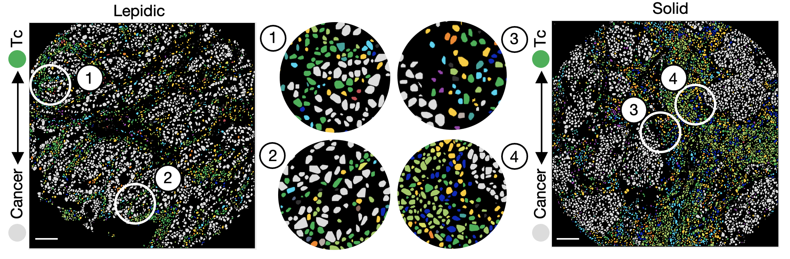

# Single-cell spatial landscapes of the lung tumor immune microenvironment

This repository includes codes and data used in the "Single-cell spatial landscapes of the lung tumor immune microenvironment" paper.

## Summary
Single-cell technologies have revealed the complexity of the tumour immune microenvironment with unparalleled resolution1-3. Most clinical strategies rely on histopathological stratification of tumour subtypes, yet the spatial context of single-cell phenotypes within these stratified subgroups is poorly understood. Here we apply imaging mass cytometry to characterize the tumour and immunological landscape of 416 lung adenocarcinoma patient tumours across five histological patterns. We resolve >1.6 million cells, enabling spatial analysis of immune lineages and activation states with distinct clinical correlates, including survival. Using deep learning, we can predict with high accuracy which patients will progress after surgery using a single 1 mm2 tumour core, which could be informative for clinical management following surgical resection. Our dataset represents a valuable resource for the NSCLC research community and exemplifies the utility of spatial resolution within single-cell analyses. This study also highlights how artificial intelligence can improve our understanding of microenvironmental features that underlie cancer progression and may influence future clinical practice.

## List of repositories used in this project

You can find detail of each analysis in the following repositories. 

* [Cell Segmentation](https://github.com/walsh-quail-labs/Cell-Segmentation)
* [Cell phenotyping](https://github.com/walsh-quail-labs/Cell-Phenotyping-Lung)
* [Micro Environment Prediction](https://github.com/walsh-quail-labs/Machine-Learning-Jupyter-Notebooks)

## Data

The data folders on Zenodo are structured as follows:

1. LUAD\_IMC\_MaskTif: this folder contains masked multiplex images of the IMC cores.
2. LUAD\_IMC\_Segmentation: this folder containes the nuclei segmentation information.
2. LUAD\_IMC\_CellType: this folder containes the cell type information for each of the IMC cores.
4. LUAD Clinical Data.xlsx: this folder containes clinical data with regard to the images listed above.

